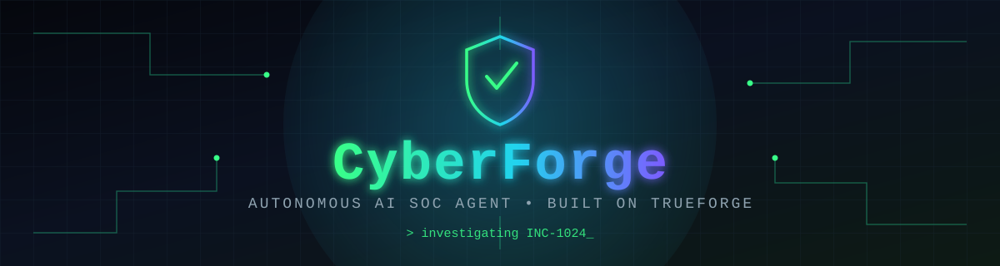
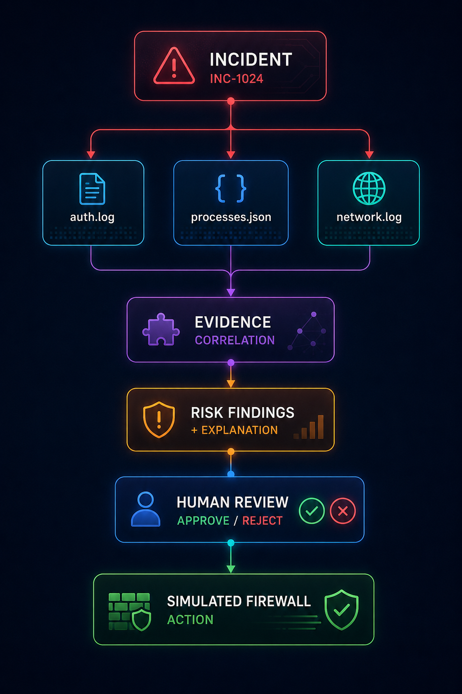
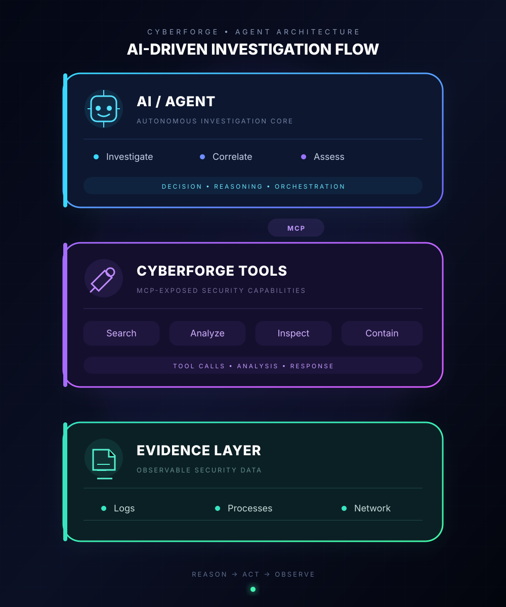
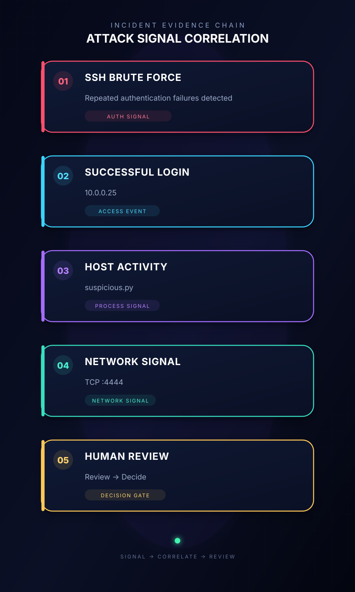
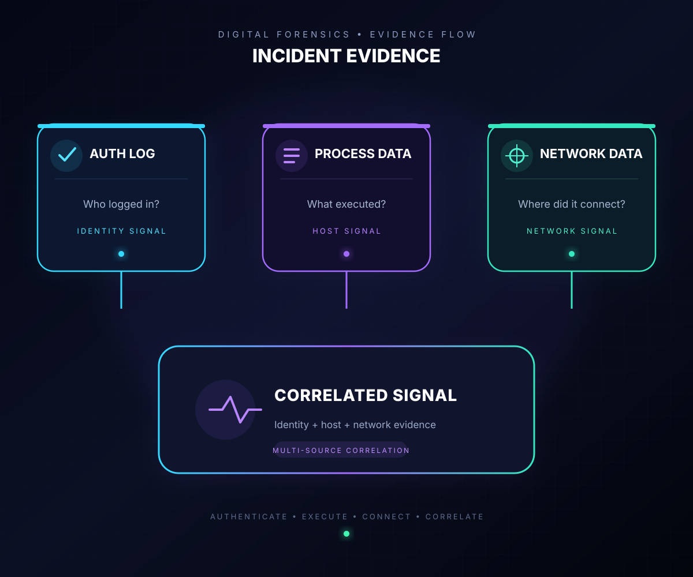

<div align="center">
  

  <h3>Signal from noise. Confidence before containment.</h3>
  <p>A local MCP-powered security investigation workspace for evidence correlation, explainable analysis, and human-approved response.</p>

  <code>INVESTIGATE</code> &rarr; <code>CORRELATE</code> &rarr; <code>ASSESS</code> &rarr; <code>APPROVE</code> &rarr; <code>CONTAIN</code>
</div>

## The mission

CyberForge turns a scattered incident trail into a concise, reviewable investigation. It correlates authentication logs, host activity, and network events around a reproducible scenario: `INC-1024`.

The objective is deliberately simple: give an analyst enough evidence to make a confident containment decision without giving the agent the final decision.

<div align="center">
  
</div>

## Investigation flow

<div align="center">
  
</div>

The diagram shows the intended agent workflow. The committed implementation provides its MCP evidence and simulation layer: explicit security capabilities sit between the agent and the local evidence.

```text
AI / Agent --> MCP --> CyberForge tools --> Evidence layer
```

The tools are intentionally small, composable, auditable, reproducible, and easy to test.

## Security toolbelt

| Tool | Purpose |
| --- | --- |
| `search_security_logs` | Search synthetic authentication events for users, IP addresses, or indicators. |
| `analyze_evidence` | Correlate authentication, process, and network evidence into an incident narrative. |
| `check_system_activity` | Inspect simulated processes and active network connections. |
| `block_ip` | Record a simulated firewall containment action after explicit human approval. |

> [!WARNING]
> `block_ip` is a simulation. It only modifies this repository's local firewall data. It does not block traffic on the host machine or an external network. A production deployment must require authentication, authorization, approval, and audit controls before containment.

## Demo incident: `INC-1024`

<div align="center">
  
</div>

`INC-1024` models an SSH brute-force sequence associated with `10.0.0.25` that progresses through the following signals:

| Stage | Observed signal |
| --- | --- |
| 1. SSH brute force | Repeated authentication failures. |
| 2. Successful login | A successful login from `10.0.0.25`. |
| 3. Host activity | `suspicious.py` executes on the host. |
| 4. Network signal | A TCP connection is established on port `4444`. |
| 5. Human review | Evidence is reviewed before any containment decision. |

The evidence is committed locally, making the scenario repeatable: **inspect -> replay -> analyze -> compare**.

## Evidence correlation

<div align="center">
  
</div>

| Evidence source | Signal |
| --- | --- |
| Authentication log | 45 failed attempts, then 3 successful logins from `10.0.0.25`. |
| Host | `python3 suspicious.py` running as `admin` immediately after login. |
| Network | A TCP connection on port `4444`, correlated with the host activity. |

The strength of the investigation comes from correlation, not a single event. A failed login can be noise; a connected sequence of login, process, and network activity is a stronger incident signal.

## Human in the loop

```text
OBSERVATION --> ANALYSIS --> RECOMMENDATION --> HUMAN DECISION --> ACTION
```

CyberForge can investigate evidence, correlate security events, explain observed signals, and recommend a response. Containment remains a human decision.

## Quick start

### Requirements

| Dependency | Version / purpose |
| --- | --- |
| Node.js | 20 or newer; runs the MCP server. |
| Python | 3.x; runs the local evidence-analysis tools. |
| MCP-compatible client | Connects to the server over standard input/output. |

### Install and start

```bash
# Install MCP server dependencies
npm install

# Start the MCP server over standard input/output
npm run mcp
```

The Python tools currently use only the standard library, so no Python package installation is required.

### Run the investigation manually

```bash
# Correlate the demo incident
python mcp_server/tools/analyze_evidence.py

# Search authentication events for the suspicious address
python mcp_server/tools/search_security_logs.py 10.0.0.25

# Inspect simulated host and network activity
python mcp_server/tools/check_system_activity.py

# Simulate containment (writes only local fixture data)
python mcp_server/tools/block_ip.py
```

## Project map

```text
CyberForge/
|- assets/                 Local README artwork and diagrams
|- mcp_server/
|  |- server.js            MCP tool registration
|  |- tools/               Python investigation and simulation tools
|  `- data/                Committed synthetic evidence
|- agent/                  Agent design and risk-scoring space
|- app/                    API application space
`- frontend/               Investigation interface space
```

## Design principles

1. **Evidence first** - every conclusion needs evidence behind it.
2. **Correlation over isolation** - a sequence of related events is stronger than one event alone.
3. **Explain before act** - the system should explain why an incident is suspicious before recommending containment.
4. **Human before containment** - high-impact actions require human approval.
5. **Reproducible by design** - committed evidence should reproduce the same investigation scenario.
6. **Inspectable infrastructure** - logs, tools, evidence, and simulated actions remain visible.

## License

Released under the [MIT License](LICENSE).
